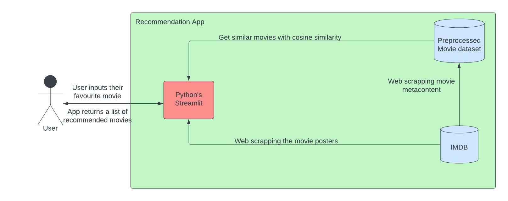
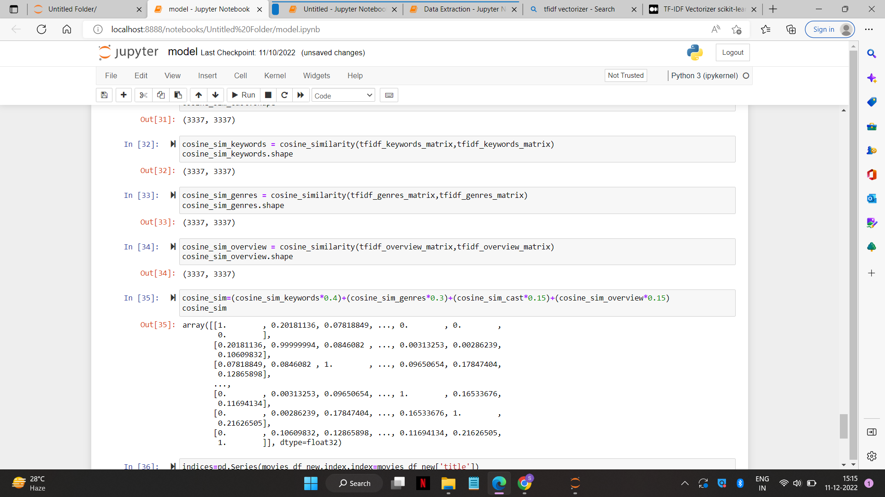
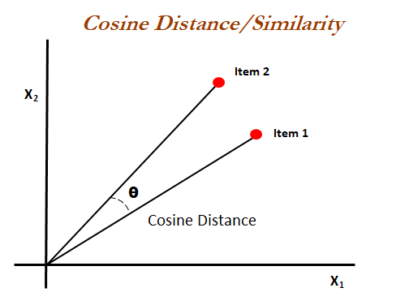

# Movie Recommender System

     

Aim : Build a content-based movie recommender system that recommends movies similar to the movie the user likes.

App : [Click on this to launch the app](https://shashwatpasari-movie-recommender-2-app-bnxdl5.streamlit.app/)

## Softwares
* Python (for backend)
* Pandas and ScikitLearn (for recommendation model)
* BeautifulSoup4 (for web scraping)
* MongoDB (for storage)
* Streamlit Cloud (for app deployement)

## Overview
The movies are recommended based on the content of the movie you entered or selected.
The details of the movies, such as the title, genre, plot, cast and poster were scraped from the IMDB website using `BeautifulSoup4` and stored in `MongoDB`. The data was cleansed and pre-processed using `pandas` and the ML model was built using `scikitlearn` (cosine_similarity) library. The main parameters that are considered for the recommendations are the genre, plot, and cast. The app was deployed to `Streamlit Cloud`.

## Live Demo
[streamlit-app-2022-12-04-10-12-26.webm](https://user-images.githubusercontent.com/70819709/206897448-310764a9-1595-4590-afa9-b3f0feb2e32a.webm)

## Architecture

## How it does:
Content Based Filtering - They suggest similar items based on a particular item. This system uses item metadata, such as genre, plot, actors, etc. for movies, to make these recommendations. The general idea behind these recommender systems is that if a person liked a particular item, he or she will also like an item that is similar to it.

## Similarity Score:
How does it decide which item is most similar to the item user likes? Here we use the similarity scores.
It is a numerical value ranges between zero to one which helps to determine how much two items are similar to each other on a scale of zero to one. This similarity score is obtained measuring the similarity between the text details of both of the items. So, similarity score is the measure of similarity between given text details of two items. This can be done by cosine-similarity.

## Cosine Similarity:
Cosine similarity is a metric used to measure how similar the documents are irrespective of their size. Mathematically, it measures the cosine of the angle between two vectors projected in a multi-dimensional space. The cosine similarity is advantageous because even if the two similar documents are far apart by the Euclidean distance (due to the size of the document), chances are they may still be oriented closer together. The smaller the angle, higher the cosine similarity.

